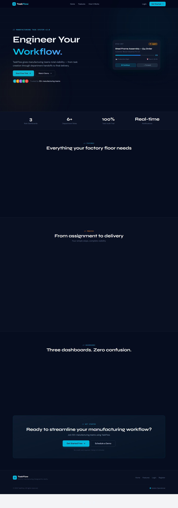
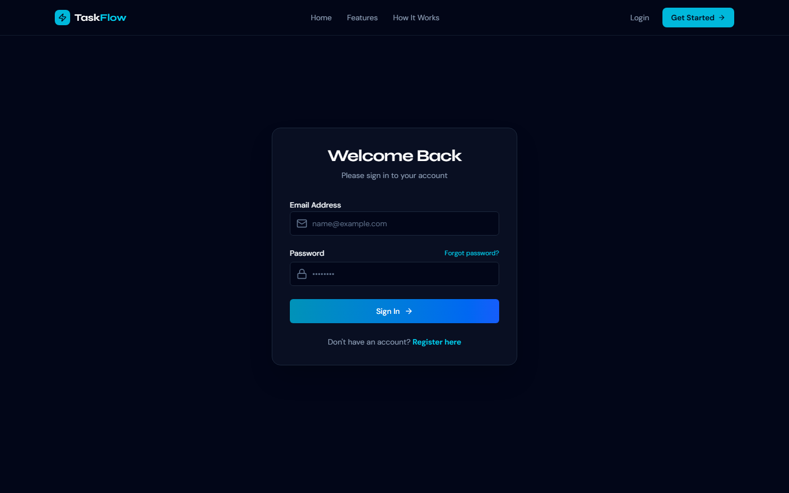
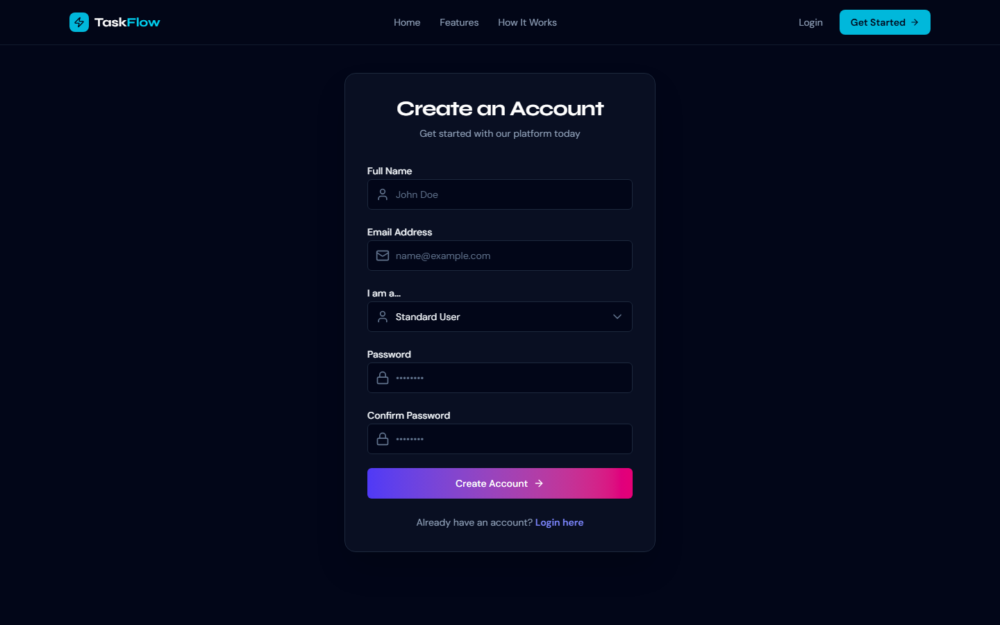

# TaskFlow

**Manufacturing task management for teams that need visibility from assignment to delivery.**

TaskFlow is a full-stack web app built for manufacturing workflows. Admins create and assign tasks with customer details and line items; team members work, forward, and complete tasks across departments—with a full audit trail and real-time notifications.

<p align="center">
  
</p>

---

## Screenshots

| Landing page | Login | Register |
|:---:|:---:|:---:|
|  |  |  |

---

## Features

- **Role-based dashboards** — Separate views for Super Admin, Admin, and department users
- **Task lifecycle** — Create, assign, start, forward between departments, and complete tasks
- **Customer & line items** — Attach customer info and multiple items (quantity, unit, notes) per task
- **Priority & deadlines** — Low / medium / high / urgent priorities with overdue tracking
- **Forward history** — Every handoff is logged with timestamps for a complete audit trail
- **User management** — Admins manage users by department; Super Admin manages admins
- **Notifications** — In-app notification panel for task updates
- **Analytics** — Admin dashboard with charts for task status and department breakdown
- **Auth & security** — JWT access/refresh tokens, email verification, forgot-password OTP, rate limiting, Helmet

---

## Tech Stack

| Layer | Technologies |
|-------|--------------|
| **Frontend** | React 19, Vite, Tailwind CSS 4, Framer Motion, Recharts, React Router |
| **Backend** | Node.js, Express 5, MongoDB, Mongoose |
| **Auth** | JWT, bcrypt, HTTP-only cookies |
| **Other** | Cloudinary (avatars), Resend (email), Multer, Zod |

---

## Project Structure

```
taskflow/
├── client/          # React + Vite frontend
│   └── src/
│       ├── pages/           # Public, admin, user, superadmin pages
│       ├── components/      # Layout, badges, notifications
│       ├── context/         # Auth context
│       └── api/             # Axios instance
├── server/          # Express API
│   ├── controllers/
│   ├── models/
│   ├── routes/
│   ├── middleware/
│   └── scripts/           # DB seed & maintenance
└── docs/
    └── screenshots/       # README assets
```

---

## Getting Started

### Prerequisites

- Node.js 18+
- MongoDB (local or Atlas)

### 1. Clone the repository

```bash
git clone https://github.com/Sakarande007/taskflow.git
cd taskflow
```

### 2. Backend setup

```bash
cd server
npm install
```

Create a `.env` file in `server/`:

```env
PORT=8080
MONGODB_URI=mongodb://localhost:27017/taskflow
FRONTEND_URL=http://localhost:5173

SECRET_KEY_ACCESS_TOKEN=your_access_secret
SECRET_KEY_REFRESH_TOKEN=your_refresh_secret

RESEND_API=your_resend_api_key
CLODINARY_CLOUD_NAME=your_cloud_name
CLODINARY_API_KEY=your_api_key
CLODINARY_API_SECRET_KEY=your_api_secret
```

Seed the Super Admin account (first run only):

```bash
node scripts/seedSuperAdmin.js
```

Default credentials:

| Field | Value |
|-------|-------|
| Email | `superadmin@taskflow.com` |
| Password | `SuperAdmin@123` |

Start the API:

```bash
npm run dev
```

### 3. Frontend setup

```bash
cd ../client
npm install
```

Create `client/.env`:

```env
VITE_API_URL=http://localhost:8080
VITE_APP_NAME=TaskFlow
```

Start the dev server:

```bash
npm run dev
```

Open [http://localhost:5173](http://localhost:5173) in your browser.

---

## User Roles

| Role | Access |
|------|--------|
| **Super Admin** | Manage admins, platform-wide stats |
| **Admin** | Create users & tasks, task tracker, department analytics |
| **Sales / Marketing / Inventory / User** | Personal dashboard, assigned tasks, forward & complete |

Departments: `sales`, `marketing`, `inventory`, `production`, `quality`, `logistics`, `management`

---

## API Overview

| Prefix | Purpose |
|--------|---------|
| `/api/user` | Registration, login, profile, password reset |
| `/api/admin` | User management, dashboard stats |
| `/api/tasks` | CRUD, forward, status updates |
| `/api/superadmin` | Admin management |
| `/api/notifications` | User notifications |

---

## Scripts

| Command | Location | Description |
|---------|----------|-------------|
| `npm run dev` | `client/` | Start Vite dev server |
| `npm run build` | `client/` | Production build |
| `npm run dev` | `server/` | Start API with nodemon |
| `npm start` | `server/` | Start API (production) |
| `node scripts/seedSuperAdmin.js` | `server/` | Create initial Super Admin |

---

## Author

**Sakarande007**

- GitHub: [@Sakarande007](https://github.com/Sakarande007)
- Repository: [github.com/Sakarande007/taskflow](https://github.com/Sakarande007/taskflow)

---

## License

ISC
